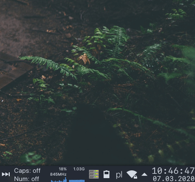

# sftper

This repository contains the code of a helper utility for mounting `sshfs` mounts from `/etc/fstab`.
The main rationale for this project was the fact that Dolphin, the default KDE file manager, doesn't show such mounts in the **Devices** section.

## Installation

TODO

## Usage

The entry point script (`/usr/bin/sftper`) starts the application, but being a desktop user, you might want sftper to start automatically on desktop start.

For this purpose, sftper provides optional arguments for managing [systemd user services](https://wiki.archlinux.org/index.php/Systemd/User).

Running `sftper --autostart` will result in copying the unit file to `$HOME/.config/systemd/user`, reloading the daemon, enabling the unit and starting it.

Conversely, running `sftper --no-autostart` reverses the aforementioned process.

## Demo

